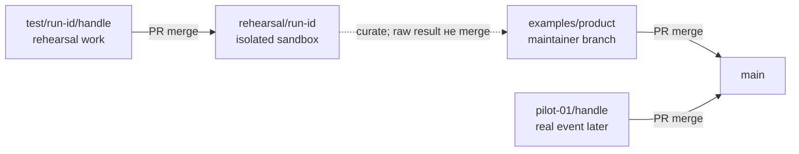

# Product Launch Lab

## Start here: 2 минуты

- За 4 часа ты не дописываешь продукт. Ты готовишь работающий продукт или идею к первому понятному тесту наружу.
- На каждом раунде открыт один файл. Остальное пока не трогай.
- К концу нужен draft PR. Публикация и рассылка только после твоего решения.

Работающий landing URL до Lab желателен, но не обязателен. Для idea-stage сначала выбираем одного user, trigger и CTA; затем делаем минимальную validation page без polish.

Результат:

**case → one-liner / Product Card → 60–90s demo → launch message → 7-day test**

## Твой маршрут

| Когда | Открой | Готово, когда |
|---|---|---|
| До встречи | [`INPUT.md`](participants/_template/INPUT.md) | Stage, текущий surface или hypothesis и limits указаны честно |
| Round 1 | [`01-POSITIONING.md`](participants/_template/01-POSITIONING.md) | User, outcome, proof и CTA понятны за 20 секунд |
| Round 2 | [`02-DEMO.md`](participants/_template/02-DEMO.md) | 60–90s video URL открывается и показывает один scenario |
| Round 3 | [`03-DISTRIBUTION.md`](participants/_template/03-DISTRIBUTION.md) | Готовы post, DM, 10 targets и одна metric |
| Finish | [`SUBMISSION.md`](participants/_template/SUBMISSION.md) | Check прошёл, PR открыт |

Во время Lab следуй текущему сообщению ведущего и [`kit/WORKBOOK.md`](kit/WORKBOOK.md). Agent prompts лежат в [`kit/prompts/`](kit/prompts/).

## До встречи

```bash
gh repo clone AI-Neighbors/product-launch-lab
cd product-launch-lab
bash scripts/init-participant.sh YOUR_GITHUB_HANDLE
```

Команда создаёт branch/folder и включает repo-local hook, который блокирует прямой push в `main` и `rehearsal/**`.

Для rehearsal организатор сначала создаёт `rehearsal/<run-id>`, затем участник запускает:

```bash
bash scripts/init-participant.sh YOUR_GITHUB_HANDLE --test RUN_ID
```

Рабочая ветка будет `test/<run-id>/<github-handle>`, PR base — `rehearsal/<run-id>`.

## Ветки и направление merge



- `test/<run-id>/<handle>` — рабочая source/head branch одного rehearsal participant.
- `rehearsal/<run-id>` — отдельная target/base branch конкретной репетиции.
- `pilot-01/<handle>` — ветка настоящего Pilot 01; для rehearsal она не используется.
- Raw rehearsal merge идёт только `test/...` → `rehearsal/...`. В `main` позже попадает отдельный очищенный example через maintainer PR.

Текущий HealthOS rehearsal:

```text
test/2026W34-healthos-01/developerisnow
  └─ PR → rehearsal/2026W34-healthos-01
```

Base уже видна на GitHub: [`rehearsal/2026W34-healthos-01`](https://github.com/AI-Neighbors/product-launch-lab/tree/rehearsal/2026W34-healthos-01). Working branch получит GitHub URL после первого push.

Запусти Codex или другой coding agent в корне repo и напиши:

```text
Я <github-handle>. Мой contact handle <optional>. Продукт <название>. Начни Product Launch Lab.
```

Project-local Participant Coach определит current phase, покажет один exact file и будет задавать по одному вопросу. Можно спрашивать что угодно: сначала он ответит, затем вернёт тебя к текущему шагу.

До встречи:

1. Заполни `participants/YOUR_GITHUB_HANDLE/INPUT.md`.
2. Сделай test push.
3. Если product/landing уже есть, запиши 10 секунд экрана знакомым recorder.
4. Открой существующий share link в incognito. Если URL пока нет, не собирай страницу до выбора user, trigger и CTA.

Используй Loom, QuickTime или уже знакомый инструмент. Creative AI tools не нужны. Video-файл в Git не добавляй.

## Finish

Pilot 01:

```bash
bash scripts/check-submission.sh YOUR_GITHUB_HANDLE origin/main
git add participants/YOUR_GITHUB_HANDLE
git commit -m "feat(capsule): add YOUR_GITHUB_HANDLE pilot-01 submission"
git push -u origin pilot-01/YOUR_GITHUB_HANDLE
gh pr create --base main --fill
```

Rehearsal:

```bash
bash scripts/check-submission.sh YOUR_GITHUB_HANDLE origin/rehearsal/RUN_ID
git add participants/YOUR_GITHUB_HANDLE
git commit -m "feat(capsule): add YOUR_GITHUB_HANDLE rehearsal submission"
git push -u origin test/RUN_ID/YOUR_GITHUB_HANDLE
gh pr create --draft --base rehearsal/RUN_ID --head test/RUN_ID/YOUR_GITHUB_HANDLE --fill
```

## Не клади сюда

- product source и datasets;
- `.env`, tokens и credentials;
- client data и private contacts;
- video binaries;
- материалы других участников.

Все collaborators private repo видят все participant folders. Используй scrubbed demo data и ссылки, которыми готов поделиться с группой.
